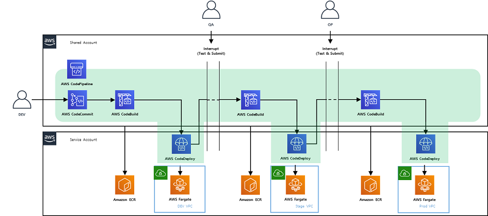

 https://www.kmong.com

#### Customer : Kmong

### Problem statement/definition
- Customers initially develop and operate services on AWS Cloud, Starting with a typical Monolithic service implementation, there was not much of an issue initially due to the small size of the service and the small number of team members.
- Currently there are nearly 100 people, Service is also progressing dramatically compared to the past, and it takes about 2 to 3 hours to deploy for service update. In the meantime, related developers were also unable to do other tasks while waiting for deployment to complete.
- Deploying 1~2 weeks deployments reduces the degree of freedom of deployment of applications, and Update does not occur fast
- These issues require access to MSA and DevOps.

### What you proposed
#### Architecture Suggestion
 - 2-tier webservice structure
 - Redundancy and Multi-Az configuration for each tier of HA
 - flexible configuration using AutoScaling
 - Minimize server management utilizing Serverless Fargate Service
 - Increase deployment efficiency with AWS Code Series for CI/CD
 - Log Integration through CloudWatch Logs
 - Log Integrated Monitoring Service Using ElasticSearch Service

 

 

#### Agile methodology
 - Through the project, which is performed in accordance with the Agile methodology for future usage, Kmong’s engineers can use the Agile methodology in the future as well.

### How AWS services were used as part of the solution
#### AWS Service Used
+ **API Gateway**
+ **CodeCommit / CodeBuild / CodeDeply / CodePipeLine**
+ **Cloud Formation**
+ **ECS (Fargate/ECR)**
+ **CloudWatch & ElasticSearch**
+ **IAM, Etc… (ELB,RDS 등)**

### Outcomes
- Ensure visibility into AWS resource usage by team through account separation and increase convenience due to resource separation
- Serverless Fargate eliminates server management discomfort
- Improve quality and performance of applications
- **Increase deployment convenience by establishing CI/CD**
- Reduced expenditure on development, testing, or operation
- Improving the efficient work capacity of development personnel
- **Service separation reduces application deployment time**
- **Reduce Application Release deployment time**
