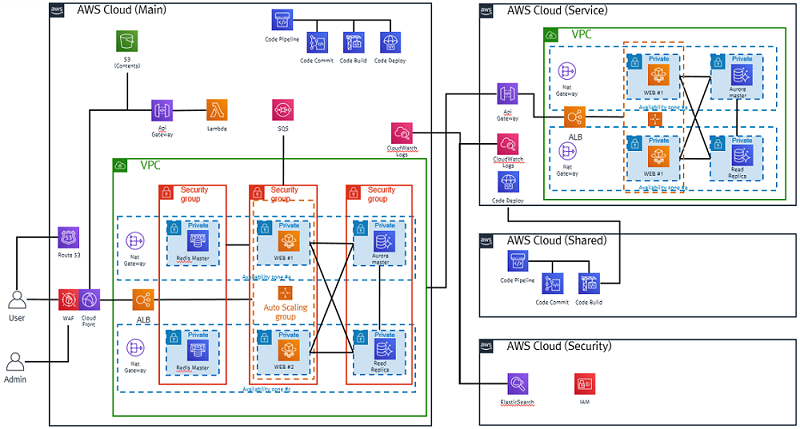
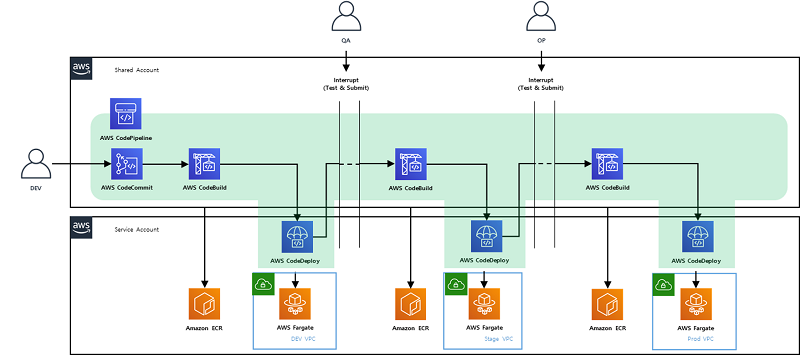

 https://www.kmong.com

#### Customer : 크몽 ( Kmong )

### Problem statement/definition
- 고객은 초기 부터 AWS Cloud에서 서비스 개발 및 운영을 진행, 전형적인 Monolitic한 서비스 구현을 시작으로 초기에는 서비스 규모와 팀원이 작아 큰 이슈가 없었음.
- 현재는 100명 가까이 인력 늘어 났으며, 서비스 역시 예전에 비해 비약적으로 발전을 한 상태로 서비스 업데이트를 위해 배포시 약 2~3시간 가량 소요되며, 그동안 관련 개발자들 역시 배포완료까지 대기하며 다른 업무를 하지 못하는 문제 점이 있었음.
- 주 단위 또는 2주 단위 배포로 Application의 배포의 자유도가 떨어지고 업데이트가 빠르게 일어나지 못함
- 이런 문제점들을 개기로 MSA 및 DevOps로의 접근 필요해짐

### What you proposed
#### 제안 Architecture
 - 2tier 웹서비스 구조
 - 각 Tier별 HA를 위한 이중화 및 Multi-Az 구성
 - AutoScaling을 이용한 유연한 구성
 - Serverless Fargate Service 를 활용한 서버관리 최소화
 - CI/CD를 위한 AWS Code Series를 활용한 배포 효율성 증대
 - CloudWatch Logs를 통한 Log Integration
 - ElasticSearch 서비스를 이용한 Log 통합 모니터링 서비스 진행

 

 

#### Agile 개발 방법론
 - 프로젝트를 통해서 Kmong의 Engineer들이 향후에도 Agile 개발 방법론을 활용할 수 있게 프로젝트를 Agile 개발방법론과 같이 진행 함.

### How AWS services were used as part of the solution
#### 사용된 AWS Service
+ **API Gateway**
+ **CodeCommit / CodeBuild / CodeDeply / CodePipeLine**
+ **Cloud Formation**
+ **ECS (Fargate/ECR)**
+ **CloudWatch & ElasticSearch**
+ **IAM, Etc… (ELB,RDS 등)**

### Outcomes
- Account 분리를 통한 팀별 AWS Resource 사용량에 대한 가시성 확보 및 Resource 분리로 인한 편의성 증대
- Serverless Fargate 도입으로 서버 관리에 대한 불편함을 해소
- Application의 품질 및 성능 향상
- CI/CD 구축으로 인한 배포 편의성 증대
- 개발,테스트 또는 운영에 대한 지출 감소
- 개발 인력들의 효율적인 업무능력 향상
- Service 분리로 인한 Application 배포 소요 시간 단축
- Application Release 배포 기간 단축
