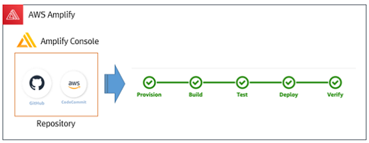

 http://www.refine.co.kr/

#### Customer : 리파인 ( Refine )

### Problem statement/definition
- 고객은 기존 온프레미스 환경의 서비스를 국내 클라우드 업체로 마이그레이션하여 운영하고 있었으나 보장된 기능과 성능적 문제로 인하여 AWS 클라우드로 마이그레이션 진행하여 운영 중
- 현재 개인정보 영역을 제외하고 대부분 AWS Cloud에서 서비스 개발 및 운영을 진행하고 있으며, 대부분 B2B 영역으로 서버개발이 대부분으로 전형적인 Monolitic한 서비스로  구현하여 운영 중.
- 새로운 사업 분야 개척으로 신규로 개발이 필요한 영역이 기존 B2B가 아닌 B2C 영역으로 모바일 개발에 대한 새로운 요구사항을 대응할 수 있는 AWS의 서비스 제안 요청함.
- 내부 개발 인력중 모바일 개발인력은 전무하였으며, 회사내 개발자들도 클라우드 기반의 모바일 개발 경험이 없어 짧은 프로젝트 기간에 성과를 낼 수 있는 방안이 필요함.
- 최초 구글의 Firehose 기반의 개발을 고려하였으나, AWS와 같이 Amplify를 제안함
- Amplify 기반의 개발과 최적화, 그리고 Serverless 기반의 서비스 개발의 요건에 따라 MSA 및 DevOps로의 접근 필요하여 프로젝트로 진행하게 됨

 

### How AWS services were used as part of the solution
#### 사용된 AWS Service
+ **Amplify**
+ **Amplify Console (CI/CD) : Git / CodeCommit / CodeBuild & Deploy**
+ **Cloud Formation**
+ **API Gateway (Front & Back) / SQS / CloudWatch & ElasticSearch / CloudWatch**
+ **IAM, Etc… (ELB,RDS 등)**

### Third party applications or solutions used
+ **JUUL API 사용**
+ **Google Analytics**

### Outcomes
- Account 분리를 통한 팀별 AWS Resource 사용량에 대한 가시성 확보 및 VPC별 Service Group 구분으로 보안 향상
- Amplify 사용으로 Serverless기반 능동적인 서비스 확보
- Application의 품질 및 성능 향상
- Amplify의 CI/CD자동화를 통한 배포 편의성 증대 및 Application 배포 소요 시간 단축 및 Release 배포 기간 단축
- 모바일 개발 자동화로 기존 서버 개발 인력의 활용성을 높여 비용 절감
- VPC별 Service 분리로 인한 보안 확보
